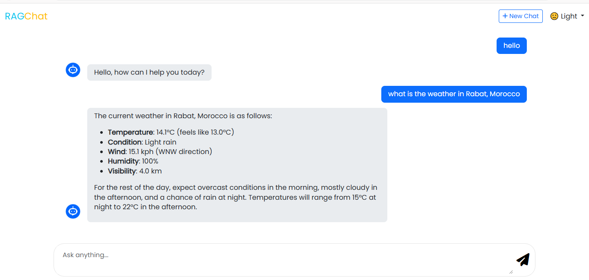

# 🤖 Agentic RAG Conversational System with Real-Time Web Retrieval

<p align="center">
  
</p>

---

## 🌐 Overview

This project implements an **Agentic Retrieval-Augmented Generation (RAG) Conversational System** capable of answering both knowledge-based and real-time queries using external tools.

Unlike traditional RAG systems, this project introduces an **agentic decision layer** that dynamically selects the best tool to answer a user query.

It supports:

- 🧠 LLM-based reasoning
- 🌐 Real-time web search (Tavily API)
- 📚 Wikipedia retrieval
- 💬 Multi-turn conversation memory
- ⚡ Autonomous tool selection (Agent behavior)

---

## 🧠 System Design Philosophy

Instead of forcing every query into retrieval, the system follows a reasoning-first approach:

1. Understand the user query
2. Decide whether tools are needed
3. Select the appropriate tool (if required)
4. Generate a grounded final response

This reduces unnecessary API calls and improves response accuracy.

---

## 🔄 Architecture Flow

### Step 1 — User Input

User sends a message via chat interface.

### Step 2 — Agent Decision Layer

The system decides:

- Direct LLM response
- Wikipedia retrieval
- Real-time web search

### Step 3 — Tool Execution (if needed)

- 🌐 Tavily API → real-time web results
- 📚 Wikipedia → structured knowledge retrieval

### Step 4 — Response Generation

LLM combines:

- Retrieved context
- Chat history
- User query

### Step 5 — Memory Handling

Each session is stored using a `thread_id` for contextual conversations.

---

## 🧩 Key Features

### 🤖 Agentic AI

Automatically selects tools based on query intent.

### 🌐 Real-Time Web Retrieval

Handles live queries like:

- Weather
- News
- Current events

### 📚 Hybrid Knowledge System

Combines:

- LLM internal knowledge
- Wikipedia
- Web search

### 🧠 Conversation Memory

Maintains multi-turn context per session.

### 💬 Chat Interface

Built using FastAPI + Jinja2.

---

## 🏗️ System Architecture

```
User
  ↓
Frontend (Chat UI)
  ↓
FastAPI Backend
  ↓
Agent Orchestrator
  ↓
┌──────────────────────────────┐
│          Tools Layer         │
│  - NVIDIA LLM               │
│  - Wikipedia Retriever      │
│  - Tavily Web Search        │
└──────────────────────────────┘
  ↓
Final Response
  ↓
FastAPI Backend
  ↓
Frontend Display
```

---

## 📁 Project Structure

```
Agentic-RAG-System/
│
├── main.py                 # FastAPI entry point
├── config.py              # Environment variables
│
├── agent/
│   ├── orchestrator.py    # Agent decision logic
│   ├── tools.py           # Web + Wikipedia tools
│   └── memory.py         # Conversation memory
│
├── templates/
│   ├── chat.html
│   └── layout.html
│
├── static/
│   ├── css/
│   ├── js/
│
├── .env.example
├── requirements.txt
└── README.md
```

---

## ⚙️ Installation & Setup

### 1️⃣ Clone the Repository

```bash
git clone https://github.com/your-username/agentic-rag-system.git
cd agentic-rag-system
```

---

### 2️⃣ Create Virtual Environment

```bash
python -m venv .venv
```

#### Activate Environment

```bash
# Windows
.venv\Scripts\activate

# Linux / Mac
source .venv/bin/activate
```

---

### 3️⃣ Install Dependencies

This project uses **uv** as the package manager (instead of pip).

Install all dependencies defined in `pyproject.toml`:

```bash
uv sync
```

---

### 4️⃣ Setup Environment Variables

```bash
cp .env.example .env
```

Then edit `.env`:

```env
NVIDIA_API_KEY=your_nvidia_api_key
TAVILY_API_KEY=your_tavily_api_key
```

---

## ▶️ Run the Project

```bash
uv run fastapi dev
```

Open:

```
http://127.0.0.1:8000/new_chat
```

## 🧠 Why This Project Matters

This project demonstrates:

- Real-world Agentic AI system design
- RAG + Tool integration
- Real-time information retrieval
- Production-level FastAPI architecture
- Multi-source reasoning systems

It goes beyond standard RAG by introducing **autonomous tool selection**.

---

## 🚀 Future Improvements

- Streaming responses (ChatGPT-like UX)
- Persistent vector memory (FAISS / ChromaDB)
- User authentication
- Multi-agent collaboration
- Logging + analytics dashboard

---

## 👨‍💻 Author

**Mbarek Hanini**  
Data Scientist & AI engineer

Specialized in:

- Agentic AI Systems
- RAG / GraphRAG architectures
- LLM-based workflow automation

🔗 LinkedIn: https://www.linkedin.com/in/mbarek-hanini-19492a34b/

---

> > > > > > > d8f529c (Initial commit - Agentic RAG system)
